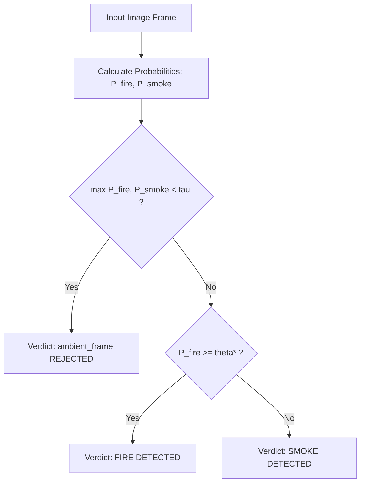

# 🔥 Fire & Smoke Classification with Dual-Gate Confidence Rejection

A production-ready computer vision pipeline designed for safety-critical fire and smoke classification from unstructured imagery, featuring an asymmetric safety loss formulation ($\text{Fire Recall} \ge 90\%$) and an ambient confidence-gating rejection mechanism.

---

## 📌 Key Architectural Highlights

* **Multi-Tier Model Spectrum**:
  * **Tier 1 (Classical Baseline)**: LightGBM trained on 123 handcrafted features (RGB & HSV histograms, color moments, texture/Sobel descriptors).
  * **Tier 2 (CNN Anchor)**: ResNet18 transfer learning with frozen backbone stages (`conv1`, `bn1`, `layer1`) and a custom classification head (`Dropout(0.3) + Linear(512, 2)`).
  * **Tier 3 (Vision Transformer & Champion)**: DeiT-Tiny (`deit_tiny_patch16_224`) fine-tuned with frozen patch embeddings and early transformer blocks. Selected as the **Champion Model** for meeting safety constraints ($\text{Fire Recall} \ge 90\%$) with competitive CPU inference latency.
* **Dual-Gate Serving Architecture**:
  * **Gate 1 — Ambient Rejection**: Frames where $\max(P_{\text{fire}}, P_{\text{smoke}}) < \tau$ (default $\tau = 0.70$) are classified as `ambient_frame`, suppressing false alarms from normal surveillance scenes without active combustion.
  * **Gate 2 — Calibrated Hazard Detection**: For non-ambient frames, fire is declared if $P_{\text{fire}} \ge \theta^*$ (calibrated threshold $\theta^* \approx 0.50$ prioritizing zero false negatives on true fire events).
* **Hot-Start Capability**: Pre-trained, repo-committed weights (`src/models/models_reproduce/`) allow immediate inference, UI interaction, and test benchmark evaluation with zero mandatory retraining.

---

## 📂 Repository Layout

```
.
├── Data_Preprocessed/               # Split dataset (train / valid / test)
├── src/
│   ├── data/
│   │   └── pipeline.py              # Ingestion, pHash deduplication, DataLoaders
│   ├── features/
│   │   └── extract.py               # Color histograms, moments, Sobel edge features
│   ├── models/
│   │   ├── train_lightgbm.py        # Tier 1 training & booster serialization
│   │   ├── train_resnet.py          # Tier 2 ResNet18 fine-tuning & evaluation
│   │   ├── train_vit.py             # Tier 3 DeiT-Tiny fine-tuning & evaluation
│   │   └── models_reproduce/        # Canonical pre-exported model weights & configs
│   │       ├── champion_config.json # Champion metadata (architecture, θ, τ, SHA256)
│   │       ├── champion_model.pt    # Pre-trained DeiT-Tiny champion checkpoint
│   │       ├── tier1_lightgbm.txt   # Serialized LightGBM booster
│   │       ├── tier2_resnet18_best.pt
│   │       └── tier3_deit_tiny_best.pt
│   ├── evaluate/
│   │   ├── calibrate.py             # Threshold sweep on validation set
│   │   ├── benchmark.py             # CPU latency profiling & champion selection
│   │   └── full_benchmark.py        # Multi-tier comparison dashboards & metrics
│   ├── inference.py                 # Architecture-aware FireClassifier CLI & API
│   └── ui/
│       ├── app.py                   # Dedicated Gradio web UI application
│       └── widget.py                # Interactive in-notebook ipywidgets dashboard
├── tests/
│   ├── unit/                        # Contract & unit test suites
│   └── e2e/                         # Multi-tier end-to-end integration tests
├── training_and_evaluation.ipynb    # Interactive end-to-end training & evaluation
├── requirements.txt                 # Project dependencies
└── README.md                        # Documentation & user guide
```

---

## ⚙️ Environment Setup

### Option 1: Local Environment (Linux / macOS / Windows)

1. **Clone the repository**:
   ```bash
   git clone https://github.com/alfonsoVsebolino/FireDetection_Classification.git
   cd FireDetection_Classification
   ```

2. **Create and activate a virtual environment**:
   ```bash
   # Python 3.10+ recommended
   python3 -m venv venv
   source venv/bin/activate  # On Windows: venv\Scripts\activate
   ```

3. **Install dependencies**:
   ```bash
   pip install --upgrade pip
   pip install -r requirements.txt
   ```

### Option 2: Google Colab (GPU Acceleration)

1. Open `training_and_evaluation.ipynb` in **Google Colab**.
2. Change the runtime type to **GPU** (`Runtime` $\to$ `Change runtime type` $\to$ `T4 GPU`).
3. Execute **Cell 1**:
   * Mounts Google Drive (`/content/drive`).
   * Clones or force-syncs the repository directly into `/content/FireDetection_Classification`.
   * Installs required packages (`timm`, `lightgbm`, `imagehash`, `gradio`).

---

## 🚀 Path A: Hot-Start Inference (Zero Training Required)

You do not need to train the models from scratch to test inference. Pre-exported champion and tier models are committed under `src/models/models_reproduce/`.

### 1. Command Line Interface (CLI)

Run `src.inference` on a single image or an entire directory:

```bash
# Infer a single image with champion model
python -m src.inference --input Data_Preprocessed/test/images/test_00000.jpg

# Process an entire folder and export structured JSON
python -m src.inference \
    --input Data_Preprocessed/test/images \
    --output-json results.json \
    --threshold 0.50 \
    --ambient-tau 0.70

# Explicitly test a specific tier architecture
python -m src.inference \
    --input Data_Preprocessed/test/images/test_00000.jpg \
    --model-path src/models/models_reproduce/tier2_resnet18_best.pt
```

**JSON Output Format**:
```json
[
  {
    "file": "Data_Preprocessed/test/images/test_00000.jpg",
    "predicted_class": "fire",
    "probabilities": {
      "fire": 0.916,
      "smoke": 0.084
    },
    "confidence": 0.916,
    "operational_threshold": 0.46,
    "ambient_tau": 0.70,
    "latency_ms": 45.2
  }
]
```

### 2. Standalone Gradio Web Application

Launch the interactive web UI:

```bash
python -m src.ui.app
```
* Navigate to the provided local URL (typically `http://127.0.0.1:7860`).
* Features:
  * Model tier selector dropdown (`Champion (DeiT-Tiny)`, `ResNet18`, `LightGBM`).
  * Live interactive sliders for $\theta$ (Hazard Decision Threshold) and $\tau$ (Ambient Rejection Gate).
  * Real-time probability bar indicators and inference latency readout.

### 3. Programmatic Python API

Integrate `FireClassifier` into your own Python workflow:

```python
from PIL import Image
from src.inference import FireClassifier

# Zero-argument initialization automatically discovers champion config & weights
classifier = FireClassifier(device="cpu")

# Predict on an image
image = Image.open("Data_Preprocessed/test/images/test_00000.jpg")
result = classifier.predict_image(image)

print(f"Predicted Class: {result['predicted_class']}")
print(f"Probabilities:   {result['probabilities']}")
print(f"Confidence:      {result['confidence']:.3f}")
print(f"Latency:         {result['latency_ms']:.2f} ms")
```

---

## 📓 Path B: End-to-End Notebook Pipeline

To train, calibrate, and benchmark all model tiers from scratch, open and run `training_and_evaluation.ipynb`.

### Pipeline Walkthrough:

| Section | Notebook Step | Description | Key Modules Used |
| :--- | :--- | :--- | :--- |
| **0–1** | **Setup & Runtime Verification** | Mounts Colab drive, validates CUDA device availability, sets random seeds. | `torch`, `sys` |
| **2** | **Data Ingestion & Deduplication** | Resolves dataset directory, filters corrupt images, computes 64-bit pHash, and prunes near-duplicates ($d_H \le 4$). | `src.data.pipeline` |
| **3** | **Tier 1: Classical Baseline** | Extracts 123 color/texture descriptors and trains a weighted LightGBM booster ($w_{\text{fire}} = 2.0$). | `src.models.train_lightgbm` |
| **4** | **Tier 2: ResNet18 CNN Anchor** | Fine-tunes ResNet18 with frozen `conv1..layer1` backbone and weighted cross-entropy loss. | `src.models.train_resnet` |
| **5** | **Tier 3: DeiT-Tiny ViT** | Fine-tunes `deit_tiny_patch16_224` with frozen patch embeddings and early transformer blocks. | `src.models.train_vit` |
| **6** | **Decision Threshold Calibration** | Sweeps decision thresholds $\theta \in [0.10, 0.90]$ on validation set to guarantee $\text{Fire Recall} \ge 90\%$. | `src.evaluate.calibrate` |
| **7** | **CPU Latency & Champion Selection** | Measures 50-sample CPU latency, evaluates safety constraints, and selects DeiT-Tiny as champion. | `src.evaluate.benchmark` |
| **8** | **Dual-Gate Ingestion Verification** | Validates Gate 1 ambient suppression on mock/real surveillance frames. | `src.inference` |
| **9** | **Full Test Split Benchmark** | Computes test set confusion matrices, PR/ROC curves, and exports benchmark dashboards. | `src.evaluate.full_benchmark` |
| **10** | **Interactive Playground** | Embedded ipywidgets dashboard for interactive testing within notebook cells. | `src.ui.widget` |

> [!TIP]
> **Hot-Start in Notebook**: If you only want to review evaluation metrics or test the interactive UI without waiting for training, run Sections 0–2, then skip directly to Section 9 (Full Benchmark) and Section 10 (Interactive Playground). The notebook automatically loads the pre-exported models from `src/models/models_reproduce/`.

---

## 🎛️ Dual-Gate Theory & Operational Tuning

Industrial surveillance feeds capture mostly ambient non-hazard scenes. A naive binary classifier will inevitably output either `fire` or `smoke` with high false alarm rates. The dual-gate engine solves this:



### Parameter Tuning Reference

| Parameter | Symbol | Default | Range | Impact & Operational Guidance |
| :--- | :---: | :---: | :---: | :--- |
| **Ambient Gate** | $\tau$ | `0.70` | `0.50 – 0.95` | **Confidence Rejection Threshold**. Higher values reject more ambient frames, reducing false alarms. Lower values allow ambiguous scenes to proceed to Gate 2. |
| **Hazard Threshold** | $\theta^*$ | `0.50` | `0.10 – 0.90` | **Fire Detection Boundary**. Lower values prioritize fire recall (fewer false negatives). Higher values demand higher flame confidence before raising a fire alert. |
| **Fire Class Weight** | $w_{\text{fire}}$ | `2.0` | `1.0 – 5.0` | **Asymmetric Loss Weighting**. Applied during training to penalize missed fire detections twice as heavily as missed smoke detections. |

---

## 🧪 Test Suite & Verification

The repository includes a comprehensive `pytest` test suite verifying interface contracts, mathematical invariants, boundary conditions, and end-to-end pipelines.

```bash
# Run all unit tests
pytest tests/unit/ -v

# Verify hot-start model loading and integrity
pytest tests/unit/test_hotstart.py -v

# Verify Gradio web interface contracts
pytest tests/unit/test_app.py -v

# Run full end-to-end integration test suite
pytest tests/e2e/ -v
```

---

## 📊 Dataset Attribution

The dataset preprocessed in `Data_Preprocessed/` contains balanced subsets of active fire scenes, particulate combustion smoke, and unclassified ambient surveillance frames formatted at $224 \times 224$ pixels.
